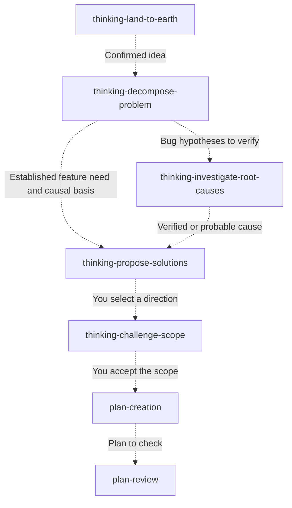
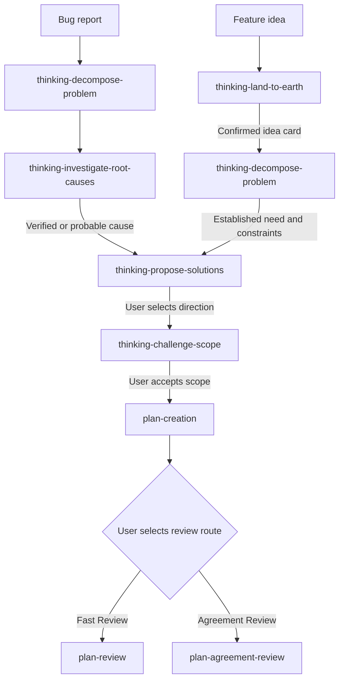

# Thinking Skills

A collection of 20 Codex skills for clarifying ideas, investigating problems, comparing options, and reviewing implementation plans. Each skill is a directory with a `SKILL.md` entry point and, where needed, supporting references, assets, or a script.

The skills can be used individually. `thinking-orchestrate-to-plan` combines several of them into a guided bug or feature workflow that ends with a reviewed plan. It does not implement the plan.

## Background

The thinking skills grew from techniques from I found on internet about "Critict Thinking". Its lessons cover breaking down problems, distinguishing symptoms from causes, structuring ideas, writing clear instructions with CIRC, defining a good outcome, verifying information, detecting bias, generating ideas, and analyzing and synthesizing sources.

## Get started

Install the skill folders you want into your Codex skills directory. For example:

```sh
git clone https://github.com/SaulBurgos/thinking-skills.git
mkdir -p "${CODEX_HOME:-$HOME/.codex}/skills"
cp -R thinking-skills/thinking-decompose-problem "${CODEX_HOME:-$HOME/.codex}/skills/"
```

The copy command installs one skill; repeat it for other skills you want to use. If a destination folder already exists, review its contents before replacing it. Keep a skill's entire folder together so its `references/`, `assets/`, `scripts/`, and `agents/` files remain available. [OpenAI's Codex skill guidance](https://developers.openai.com/blog/eval-skills) describes user and repository skill locations and explicit invocation with a `$` prefix.

You can then ask Codex, for example:

> Use `$thinking-decompose-problem` to break down this issue before we decide on a fix.

> Use `$plan-review` to check this implementation plan against the current code.

`thinking-land-to-earth` and `thinking-show-me` require explicit invocation. The other skills can be invoked by name when you want a particular workflow.

## Skills Descriptions

### Understand and explore

#### [`thinking-align-context`](thinking-align-context/SKILL.md)

- **What it does:** Shows which goal and earlier context guide the current response.
- **What you get:** A short alignment report with gaps you can correct.
- **When to use it:** You suspect the agent is following an outdated requirement.
- **What it reads:** The current conversation; earlier history or artifacts only when requested.

#### [`thinking-analyze-transcript`](thinking-analyze-transcript/SKILL.md)

- **What it does:** Extracts the important content of a meeting or discussion.
- **What you get:** Topics, decisions, action items, open questions, risks, and disagreements.
- **When to use it:** You need to turn a transcript into a usable summary.
- **What it reads:** The supplied transcript, including available speakers and timestamps.

#### [`thinking-catch-me-up`](thinking-catch-me-up/SKILL.md)

- **What it does:** Reconstructs where a task stopped.
- **What you get:** A short brief covering progress, stopping point, and next action.
- **When to use it:** You are returning to a task after time away.
- **What it reads:** The conversation; narrow current checks only if you request live status.

#### [`thinking-decompose-problem`](thinking-decompose-problem/SKILL.md)

- **What it does:** Separates a broad problem into factors, relationships, and hypotheses.
- **What you get:** A problem map, provisional causal chains, priorities, and gaps.
- **When to use it:** You need to understand an unclear issue before investigating causes.
- **What it reads:** Your problem description and limited relevant read-only evidence.

#### [`thinking-evaluate-bias`](thinking-evaluate-bias/SKILL.md)

- **What it does:** Checks framing and evidence for representation, confirmation, and omission bias.
- **What you get:** Supported bias findings, their effect, and small balancing actions.
- **When to use it:** A proposal or conclusion may overlook people or contrary evidence.
- **What it reads:** The work being evaluated and evidence needed to check each finding.

#### [`thinking-evaluate-circ`](thinking-evaluate-circ/SKILL.md)

- **What it does:** Checks an instruction for Context, Intention, Restrictions, and Criteria for Success.
- **What you get:** A CIRC assessment, material gaps, and clarification questions.
- **When to use it:** A task request may be missing constraints or success criteria.
- **What it reads:** The instruction and available surrounding context.

#### [`thinking-expand-problem-space`](thinking-expand-problem-space/SKILL.md)

- **What it does:** Explores one new angle using questions, perspective, analogy, or inversion.
- **What you get:** A focused exploration and short summary.
- **When to use it:** You want to widen your thinking before choosing an answer.
- **What it reads:** The problem, goal, or opportunity and the context you provide.

#### [`thinking-explain`](thinking-explain/SKILL.md)

- **What it does:** Explains a complex topic or artifact in plain language.
- **What you get:** A practical explanation, with a small visual when useful.
- **When to use it:** You need to understand a design, plan, or technical concept.
- **What it reads:** The topic or artifact and any material source content.

#### [`thinking-land-to-earth`](thinking-land-to-earth/SKILL.md)

- **What it does:** Clarifies a vague idea into a concrete, user-confirmed concept.
- **What you get:** A Grounded Idea Card, or a draft if important gaps remain.
- **When to use it:** You have an idea such as “make onboarding easier” but no defined outcome. Invoke it explicitly.
- **What it reads:** Your idea and directly relevant facts found through bounded read-only discovery.

#### [`thinking-show-me`](thinking-show-me/SKILL.md)

- **What it does:** Makes the current topic easier to see through a focused visual.
- **What you get:** A diagram, diff, pseudocode, call tree, or HTML artifact as appropriate.
- **When to use it:** You want to see a workflow or comparison. Invoke it explicitly.
- **What it reads:** The current topic and relevant source or artifact details.

### Investigate and decide

#### [`thinking-investigate-root-causes`](thinking-investigate-root-causes/SKILL.md)

- **What it does:** Tests causal hypotheses against collected evidence.
- **What you get:** Verified, probable, rejected, or unresolved findings and a causal model when useful.
- **When to use it:** You have decomposed a problem and need to establish why it happens.
- **What it reads:** A full decomposition or equivalent analysis, evidence, and relevant read-only sources.

#### [`thinking-propose-solutions`](thinking-propose-solutions/SKILL.md)

- **What it does:** Compares solution directions grounded in a causal model.
- **What you get:** Options, tradeoffs, a minimum safe direction, and a decision boundary.
- **When to use it:** You know the likely cause or feature need and must choose an approach.
- **What it reads:** The causal model, priorities, constraints, and relevant decision evidence.

#### [`thinking-challenge-scope`](thinking-challenge-scope/SKILL.md)

- **What it does:** Finds a smaller version of a selected approach that preserves its purpose.
- **What you get:** A lean alternative, protected core, remaining risks, and recommendation.
- **When to use it:** A proposed solution or plan may be larger than necessary.
- **What it reads:** The selected approach, accepted outcome, constraints, and targeted evidence.

#### [`thinking-track-investigation`](thinking-track-investigation/SKILL.md)

- **What it does:** Maintains a durable investigation record across work sessions.
- **What you get:** An orientation, updated record, checkpoint, child record, or closure.
- **When to use it:** Findings and next steps need to survive a handoff.
- **What it reads:** The canonical record, its navigation file when present, and supplied updates. Record writes require approval.

### Plan and review

#### [`plan-creation`](plan-creation/SKILL.md)

- **What it does:** Turns an agreed goal into an implementation-ready plan.
- **What you get:** Scope, success criteria, phases, validation, risks, and assumptions.
- **When to use it:** You are ready to plan a feature or fix before coding.
- **What it reads:** Your goal, repository rules, existing patterns, code, and relevant dependencies.

#### [`plan-review`](plan-review/SKILL.md)

- **What it does:** Checks a proposed plan against the current codebase.
- **What you get:** A readiness verdict and evidence-backed findings.
- **When to use it:** You want to know whether a plan is safe to implement.
- **What it reads:** The full plan, repository instructions, relevant code, tests, and schemas.

#### [`plan-critique-review`](plan-critique-review/SKILL.md)

- **What it does:** Tests review feedback against repository evidence before changing a plan.
- **What you get:** A claim-by-claim assessment and justified plan changes when authorized.
- **When to use it:** A reviewer challenges a plan with claims that need verification.
- **What it reads:** The plan, critique, repository instructions, and relevant code or tests.

#### [`plan-agreement-review`](plan-agreement-review/SKILL.md)

- **What it does:** Runs local checks and a persistent Claude review loop on a plan.
- **What you get:** An agreement report, readiness status, plan changes, and unresolved gaps.
- **When to use it:** A complex plan needs an independent review and agreement. Sending material to Claude requires approval.
- **What it reads:** One local Markdown plan, relevant repository evidence, and approved Claude review context.

#### [`thinking-orchestrate-to-plan`](thinking-orchestrate-to-plan/SKILL.md)

- **What it does:** Guides a bug or feature through investigation, decisions, planning, and review.
- **What you get:** A reviewed implementation plan and readiness verdict, before implementation.
- **When to use it:** You want one guided path from an initial problem or idea to a plan.
- **What it reads:** Your context, relevant read-only evidence, workflow references, and selected review route.

#### [`claude-code-reviewer`](claude-code-reviewer/SKILL.md)

- **What it does:** Requests a bounded independent analysis from Claude Code.
- **What you get:** Review findings or design feedback with evidence and uncertainties.
- **When to use it:** You need a second opinion on a repository question. Sending material to Claude requires approval.
- **What it reads:** The approved prompt and repository or artifact scope, plus applicable instructions.

## Use skills individually

Each box can be a separate request. Start wherever you already have the required input; the dashed arrows suggest a useful next skill, not an automatic call.



For example, after using `thinking-decompose-problem`, you can ask: “Use `$thinking-investigate-root-causes` with the decomposition above.” Other skills in the catalog can also be invoked on their own for explanation, bias checks, transcript analysis, tracking, or visual help.

## Orchestrate a plan

`thinking-orchestrate-to-plan` follows one of these paths and stops after a reviewed plan:



| Review route | Dependencies and requirements |
| --- | --- |
| Fast Review | `plan-review` checks the plan locally and read-only. It completes the workflow only with a `ready` verdict. |
| Agreement Review | `plan-agreement-review` uses `claude-code-reviewer`, `plan-critique-review`, `plan-creation`, and `plan-review`. It requires a named local plan, an installed and authenticated Claude Code CLI, and explicit approval for the material sent to Anthropic. |

The skills also work individually when their inputs are available. `thinking-investigate-root-causes` needs a complete decomposition or equivalent causal model; `thinking-propose-solutions` needs a verified or probable causal model or an equivalent feature need. `thinking-track-investigation` is optional: record writes require approval for the exact path, and initialization uses its bundled Python 3 script.

## Contributing

See [CONTRIBUTING.md](CONTRIBUTING.md) for issue and pull request guidance.

## License

This collection is available under the [MIT License](LICENSE).
