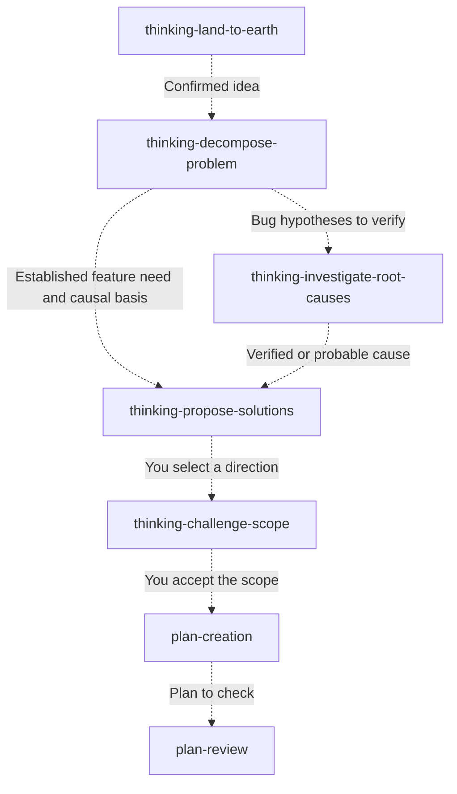
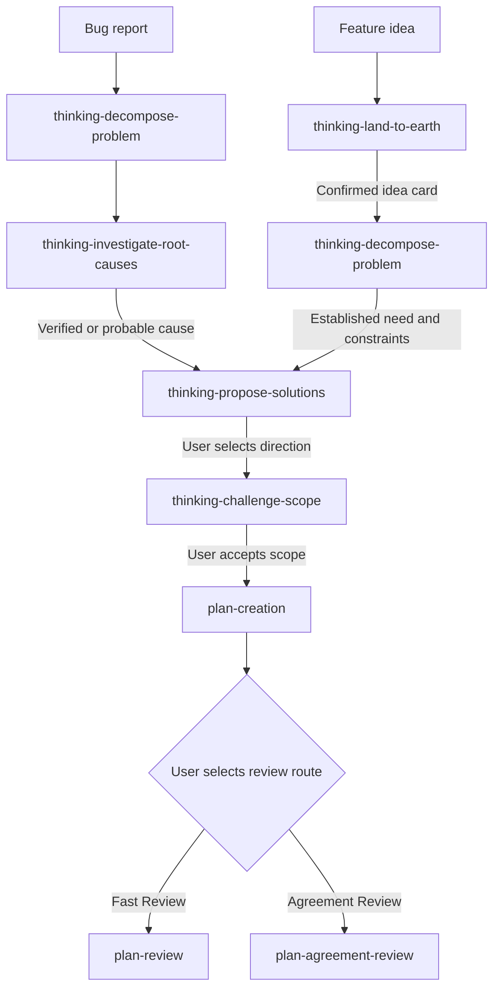

# Thinking Skills

A collection of 20 Codex skills for clarifying ideas, investigating problems, comparing options, and reviewing implementation plans. Each skill is a directory with a `SKILL.md` entry point and, where needed, supporting references, assets, or a script.

The skills can be used individually. `thinking-orchestrate-to-plan` combines several of them into a guided bug or feature workflow that ends with a reviewed plan. It does not implement the plan.

## Background

The thinking skills grew from techniques from I found on internet about "Critict Thinking". Its lessons cover breaking down problems, distinguishing symptoms from causes, structuring ideas, writing clear instructions with CIRC, defining a good outcome, verifying information, detecting bias, generating ideas, and analyzing and synthesizing sources.

## Get started

Install the skill folders you want into your Codex skills directory. For example:

```sh
git clone https://github.com/SaulBurgos/thinking-skills.git
mkdir -p "${CODEX_HOME:-$HOME/.codex}/skills"
cp -R thinking-skills/thinking-decompose-problem "${CODEX_HOME:-$HOME/.codex}/skills/"
```

The copy command installs one skill; repeat it for other skills you want to use. If a destination folder already exists, review its contents before replacing it. Keep a skill's entire folder together so its `references/`, `assets/`, `scripts/`, and `agents/` files remain available. [OpenAI's Codex skill guidance](https://developers.openai.com/blog/eval-skills) describes user and repository skill locations and explicit invocation with a `$` prefix.

You can then ask Codex, for example:

> Use `$thinking-decompose-problem` to break down this issue before we decide on a fix.

> Use `$plan-review` to check this implementation plan against the current code.

`thinking-land-to-earth` and `thinking-show-me` require explicit invocation. The other skills can be invoked by name when you want a particular workflow.

## Skills Descriptions

### Understand and explore

| Skill | Use it to | Use case |
| --- | --- | --- |
| [`thinking-align-context`](thinking-align-context/SKILL.md) | Inspect the goal and earlier context guiding the agent's response. | Check whether the agent is using an outdated requirement. |
| [`thinking-analyze-transcript`](thinking-analyze-transcript/SKILL.md) | Extract topics, decisions, actions, open questions, and disagreements from a transcript. | Turn meeting notes into decisions and action items. |
| [`thinking-catch-me-up`](thinking-catch-me-up/SKILL.md) | Get a short brief on where a task stopped and what comes next. | Resume a task after time away. |
| [`thinking-decompose-problem`](thinking-decompose-problem/SKILL.md) | Break a broad problem into factors, relationships, hypotheses, and priorities. | Split an intermittent failure into possible causes. |
| [`thinking-evaluate-bias`](thinking-evaluate-bias/SKILL.md) | Examine framing, evidence, and omissions for representation, confirmation, or omission bias. | Check whether a proposal ignores affected users. |
| [`thinking-evaluate-circ`](thinking-evaluate-circ/SKILL.md) | Check an instruction for Context, Intention, Restrictions, and Criteria for Success. | Find missing success criteria in a task request. |
| [`thinking-expand-problem-space`](thinking-expand-problem-space/SKILL.md) | Explore one new angle through questions, perspective, analogy, or inversion. | Generate questions before choosing a solution. |
| [`thinking-explain`](thinking-explain/SKILL.md) | Explain a difficult topic or artifact in plain language. | Understand a complex design proposal. |
| [`thinking-land-to-earth`](thinking-land-to-earth/SKILL.md) | Turn a vague idea into a user-confirmed Grounded Idea Card. Explicit invocation required. | Clarify what “make onboarding easier” means. |
| [`thinking-show-me`](thinking-show-me/SKILL.md) | Explain the current topic with a focused diagram, diff, or HTML artifact. Explicit invocation required. | See how two workflow options differ. |

### Investigate and decide

| Skill | Use it to | Use case |
| --- | --- | --- |
| [`thinking-investigate-root-causes`](thinking-investigate-root-causes/SKILL.md) | Check causal hypotheses against evidence after decomposing a problem. | Test whether a timeout causes failed requests. |
| [`thinking-propose-solutions`](thinking-propose-solutions/SKILL.md) | Compare evidence-grounded solution directions before planning. | Compare fixes after confirming the cause. |
| [`thinking-challenge-scope`](thinking-challenge-scope/SKILL.md) | Find the smallest safe version of a selected approach. | Cut a proposed rollout to one useful phase. |
| [`thinking-track-investigation`](thinking-track-investigation/SKILL.md) | Maintain a durable investigation record and its next step. | Save findings before handing off an investigation. |

### Plan and review

| Skill | Use it to | Use case |
| --- | --- | --- |
| [`plan-creation`](plan-creation/SKILL.md) | Draft an implementation-ready plan with success criteria, phases, and risks. | Plan a feature before changing code. |
| [`plan-review`](plan-review/SKILL.md) | Validate a proposed plan against the current code before implementation. | Check whether a migration plan fits the codebase. |
| [`plan-critique-review`](plan-critique-review/SKILL.md) | Check feedback about a plan against repository evidence before revising it. | Verify a reviewer's claim about a missing dependency. |
| [`plan-agreement-review`](plan-agreement-review/SKILL.md) | Seek plan agreement through local checks and a persistent Claude review loop. | Resolve substantive disagreements about a plan. |
| [`thinking-orchestrate-to-plan`](thinking-orchestrate-to-plan/SKILL.md) | Guide a bug or feature through investigation, decisions, planning, and a selected review route. | Take a bug report through to a reviewed plan. |
| [`claude-code-reviewer`](claude-code-reviewer/SKILL.md) | Delegate bounded read-only repository review to Claude Code. | Request an independent review of a proposed design. |

## Use skills individually

Each box can be a separate request. Start wherever you already have the required input; the dashed arrows suggest a useful next skill, not an automatic call.



For example, after using `thinking-decompose-problem`, you can ask: “Use `$thinking-investigate-root-causes` with the decomposition above.” Other skills in the catalog can also be invoked on their own for explanation, bias checks, transcript analysis, tracking, or visual help.

## Orchestrate a plan

`thinking-orchestrate-to-plan` follows one of these paths and stops after a reviewed plan:



| Review route | Dependencies and requirements |
| --- | --- |
| Fast Review | `plan-review` checks the plan locally and read-only. It completes the workflow only with a `ready` verdict. |
| Agreement Review | `plan-agreement-review` uses `claude-code-reviewer`, `plan-critique-review`, `plan-creation`, and `plan-review`. It requires a named local plan, an installed and authenticated Claude Code CLI, and explicit approval for the material sent to Anthropic. |

The skills also work individually when their inputs are available. `thinking-investigate-root-causes` needs a complete decomposition or equivalent causal model; `thinking-propose-solutions` needs a verified or probable causal model or an equivalent feature need. `thinking-track-investigation` is optional: record writes require approval for the exact path, and initialization uses its bundled Python 3 script.

## Contributing

See [CONTRIBUTING.md](CONTRIBUTING.md) for issue and pull request guidance.

## License

This collection is available under the [MIT License](LICENSE).
