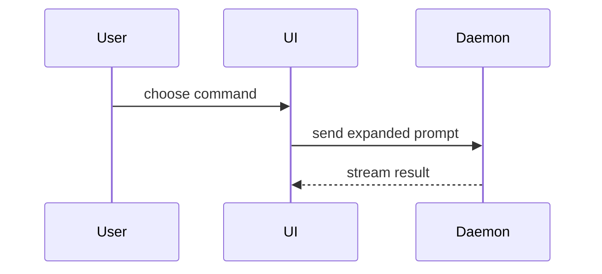

# Software Visualization

Use this reference only when `SKILL.md` routes a software-focused visual
explanation here. Identify the software decision or relationship the user needs
to inspect, then show the smallest source-faithful shape that makes it visible
and debatable. Do not visualize the whole system by default, and do not turn the
explanation into a review, recommendation, or implementation.

## Contents

- [Select the view by what it must expose](#select-the-view-by-what-it-must-expose)
- [Canonical shapes](#canonical-shapes)
- [Show change or the complete shape](#show-change-or-the-complete-shape)
- [Focused HTML artifacts](#focused-html-artifacts)
- [Presentation and source discipline](#presentation-and-source-discipline)

## Select the view by what it must expose

Choose the base view first. Then apply the comparison and presentation rules
below.

| What the reader needs to inspect | Base view |
| --- | --- |
| Logic, guards, or an algorithm | Compact pseudocode |
| Runtime orchestration or nested control flow | Call tree |
| UI ownership, state, props, or module boundaries | Component tree |
| File responsibility, codebase layout, or a broad refactor | Shallow file tree |
| Domain ownership, vocabulary boundaries, or translation between meanings | Context map |
| Order between actors or services | Mermaid sequence diagram |
| State transitions, branching flow, or data movement | Mermaid state or flow diagram |
| Contracts, types, or key method signatures | Focused code-shape block |
| User-visible UI, layout, or state whose appearance is the point | Focused HTML artifact |

Do not select Mermaid merely because several components exist. Use it when the
sequence, transition, branch, or movement between them is what the reader must
inspect. Avoid generic boxes and arrows that look complete while hiding the
actual contract, ownership, or decision.

## Canonical shapes

Use these as calibration for scope and detail, not as content to copy.

Show logic as compact pseudocode:

```text
on(save)
  if content is unchanged
    return cached result
  write new content
  return fresh result
```

Show orchestration as a call tree:

```text
submitForm
  createSession
    persistPrompt
    launchAgent
  navigateToSession
```

Show UI ownership as a component tree, including only the state and boundaries
that matter:

```text
<SessionPage> (apps/example/src/routes/session.tsx)
  useSessionEvents()
  <SessionToolbar>
    <RunSkillButton> (packages/ui)
```

Show file responsibility as a shallow tree:

```text
src/
├── commands/       # parses user actions
├── sessions/       # owns session state
└── transport/      # sends API requests
```

Show domain meaning and translation as a context map. Keep local concepts and
rules inside their owning context:

```text
[Sales]
Customer = qualified prospect
owns qualification rules
    │ qualified_account_id
    ▼
[Billing]
Customer = party responsible for payment
owns invoicing rules
```

Show interaction as a specific sequence rather than a generic architecture
diagram:



Show an interface commitment with only the types and signatures needed to
understand it:

```ts
type ExpandedCommand = {
  skillName: string
  prompt: string
}

function expandSkill(command: string): ExpandedCommand
```

## Show change or the complete shape

When the current shape is known and the point is what changes, use a diff of
the selected base view. This applies to components, files, calls, contracts,
contexts, state, and control flow.

Component change:

```diff
 <SessionPage>
   <SessionToolbar>
+    <RunSkillButton />
   <SessionTimeline>
+    <SkillResultCard />
```

File-layout change:

```diff
 src/
 ├── commands/
+│   └── show-me.ts       # expands the slash command
 ├── sessions/
-└── transport.ts
+└── transport/
+    ├── client.ts
+    └── stream.ts
```

Call-tree change:

```diff
 submitForm
   createSession
     persistPrompt
+    expandSkillMention
     launchAgent
   navigateToSession
+    subscribeToEvents
```

State or control-flow change:

```diff
 on(save)
-  write content
+  if content is unchanged
+    return cached result
+  write new content
+  invalidate cache
```

Show the complete block when most of it is new, omitted context would hide
ownership or order, or the user needs one copyable target shape. A copyable
shape is still explanatory; do not implement it unless the user separately
requests implementation.

## Focused HTML artifacts

Choose HTML when what the user will see or experience is itself the question,
or when a layout, state comparison, or dense software concept becomes more
inspectable through a focused visual artifact. HTML need not be a last resort:
a rough mockup can resolve visual ambiguity more directly than prose even when
the prose is understandable.

Before selecting HTML, check that local artifact creation and rendering are
available. Otherwise use a supported text diagram, table, or Mermaid. If the
user explicitly requires HTML, explain any capability limitation. Never claim
visual inspection was completed when it was unavailable.

- Create one focused local artifact in the environment's approved user-facing
  output location. Do not publish it or change external systems.
- Make the artifact answer one concrete question. Prefer a diagram, mockup,
  infographic, or short slide sequence over a miniature product.
- Use source-backed product colors, type, spacing, components, labels, and data
  when available. Otherwise use a neutral presentation and label invented
  content `Illustrative`.
- Support the viewport sizes that materially affect the explanation.
- Render and inspect the relevant viewports before presenting the artifact.
  Correct material overlap, clipping, overflow, unreadable text, and broken
  states.
- Present the artifact using the environment's normal render or link mechanism;
  do not hard-code a shell command to open it.

## Presentation and source discipline

- State briefly what decision or relationship each visual makes inspectable.
- Place each visual next to the short prose it supports.
- Keep only the calls, files, props, states, data, contracts, and boundaries
  needed for the current question.
- When a term or rule changes meaning across contexts, label the local meanings
  and show the material translation instead of collapsing them into one global
  model.
- Prefer one view. Combine views only when each exposes a distinct part of the
  question; do not display every available representation.
- Preserve the source's uncertainty and scope. A visual makes relationships
  visible; it does not verify or approve them.
- When a diagram, diff, mockup, or code shape adds behavior not stated in the
  source, label it `Illustrative` and do not present it as a recommendation or
  approved implementation.
- Do not invent product, architecture, or program-design decisions merely to
  complete a visual. Surface a material unknown instead.
